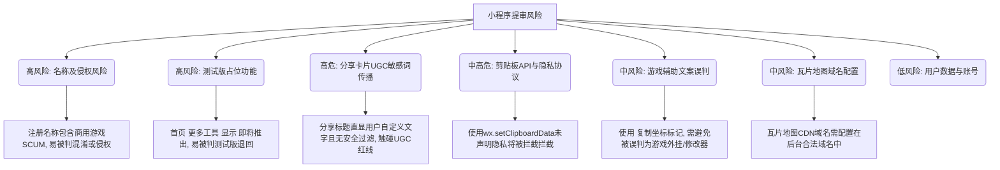

# 微信小程序审核风险评估报告：《SCUM游戏工具箱》

本报告根据[微信小程序平台常见拒绝情形](https://developers.weixin.qq.com/minigame/product/reject.html)及实际审核经验，对当前《SCUM游戏工具箱》小程序的源码、功能设计和文字内容进行了全面的审核风险评估，并针对性地给出了整改建议。

---

## 🚩 核心风险点总结

根据代码与功能的对照评估，当前小程序在提审时有 **3个高风险点** 和 **2个中风险点** 需要在发布前进行整改：

---

## 🔍 详细评估与整改方案

### 1. 【高风险】小程序注册名称与侵权风险
* **微信规则（1.1）**：小程序名称、简介、logo均不得侵犯他人权益（著作权、商标权等）。不得包含不属于该小程序主体的品牌或商标。
* **小程序现状**：
  - 界面与配置中多次使用 **“SCUM游戏工具箱”**、**“SCUM 地图”** 等字样。
* **风险分析**：
  - 微信对带有知名商业游戏名（如 *SCUM*、*人渣*）的小程序名称审查极严。如果不是官方运营或持有官方授权书，直接使用“SCUM”作为小程序注册名称，极大概率会被判定为“混淆官方”或“涉嫌侵犯他人商标/著作权”而被驳回。
* **整改方案**：
  - **建议名称去品牌化/通用化**：在微信后台注册小程序时，不要直接叫 “SCUM游戏工具箱”。可以使用工具属性的代称，例如 **“生存者地图助理”**、**“孤岛生存指南”**、**“荒野生存地图盒子”** 等。
  - **添加免责声明**：在小程序内显眼位置（例如首页底部或关于页面）加上免责声明，明确与官方的关系，防止审核人员判定误导用户：
    > *“免责声明：本小程序为玩家自制工具，与《SCUM》游戏官方（Gamepires/Jagex）无任何关联或商业合作。所使用的地图和点位数据仅供学习交流使用。”*

---

### 2. 【高风险】首页“即将推出”占位按钮（测试版风险）
* **微信规则（3.3.1）**：提交的小程序须是一个完成品，不可以是一个测试版。不可存在崩溃、闪退、按钮没有响应、文字表述不完整等。
* **小程序现状**：
  - `pages/index/index.wxml` 中有一个“更多工具”卡片，使用了 `feature-disabled` 样式，显示“即将推出”的角标，点击后没有任何实际功能响应。
* **风险分析**：
  - 微信审核人员会逐一点击界面上的所有可交互元素。一旦发现有“即将推出”、“敬请期待”等占位按钮或点击无反应的空置页面，会直接以 **“核心功能未建设完毕/属于测试版”** 为由驳回审核。
* **整改方案**：
  - **在提审版本中隐藏未完工占位卡片**：在准备提审的代码中，直接将 `pages/index/index.wxml` 第 35-45 行的“更多工具”卡片注释或删除。只保留完全可用的“SCUM 地图”卡片。
  - 只要现有的“SCUM 地图”功能完善（包含了点位筛选、输入坐标、备份导入导出），微信就不会认为小程序“功能过于简单”。

---

### 3. 【高危风险】分享卡片动态加载用户自定义文字（UGC合规）
* **微信规则（3.2.11）**：小程序的服务提供者必须提供过滤不当内容的措施（如色情、赌博等违法违规词汇）。
* **小程序现状（代码隐患）**：
  - 排查 `map.js` 的 `onShareAppMessage` 源码发现，当用户分享某一个具体的点位时，分享卡片的标题是这样拼接的：
    `title: 'SCUM地图位置：' + selectedMarker.name`
  - 这里的 `selectedMarker.name` 是允许用户完全自由输入和重命名的。
* **风险分析**：
  - 如果用户将点位重命名为政治敏感词汇或违法黑灰产广告（如“出售VPN”），然后分享到微信群。这个敏感标题会直接显示在所有群成员的屏幕上。
  - 由于小程序没有接入后端服务器去调用微信的 `security.msgSecCheck` 文本安全过滤API，这构成了**严重的 UGC（用户生成内容）合规漏洞**。如果被发现或被举报，小程序会被立刻封禁。
* **整改方案**：
  - **静态化分享标题**：最简单安全的做法是不在分享卡片标题中展示用户自定义文字。将代码中的标题改为固定的通用文案，如：`title: '我向你分享了一个地图点位，点击查看'`，彻底堵死敏感词传播途径。

---

### 4. 【中高风险】剪贴板 API 滥用与隐私指引缺失
* **微信规则（3.4.1）**：在收集和使用用户任何数据时，必须明确告知用户该数据的用途。微信现行政策要求所有涉及系统权限（包括剪贴板）的 API 必须在用户隐私保护指引中声明。
* **小程序现状**：
  - `map.js` 中使用了 `wx.setClipboardData` 实现了“复制坐标”和“导出备份数据”功能。
* **风险分析**：
  - 若未在小程序后台的【用户隐私保护指引】中明确声明需要使用“剪贴板”功能，在真机环境下，调用 `wx.setClipboardData` 会被微信基础库直接拦截失效，导致功能出现 Bug 无法使用。同时，审核人员在审查隐私合规时也会直接驳回。
* **整改方案**：
  - **补充隐私协议**：必须在微信公众平台后台的【设置】-【基本设置】-【用户隐私保护指引】中，添加使用“剪贴板”的声明，并在理由中填写：“用于用户复制地图坐标及导出个人标记数据”。

---

### 5. 【中风险】游戏辅助与“外挂”文案误判风险
* **微信规则（3.2.8.3 & 3.2.8.9）**：严厉禁止“游戏外挂、游戏辅助修改器”类小程序。
* **小程序现状**：
  - 提供了根据游戏内 Ctrl+C 复制的坐标进行定位的功能。
  - 界面提示文案为：“游戏内地图按 Ctrl+C 复制坐标，粘贴到此处点击跳转，即可标记当前位置。”
* **风险分析**：
  - 该小程序本质上是“游戏数据离线查询与个人坐标计算器”，完全不读取游戏内存或网络包，不属于外挂。但微信审核对“辅助”、“修改”等敏感词非常警惕，容易产生误判。
* **整改方案**：
  - **文案温和化，规避敏感词**：绝对不能出现“外挂”、“脚本”、“辅助”、“修改”、“外联”等字眼。
  - 将 `packageMap/pages/map/map.wxml` 中的提示词改写为更安全、工具化的表述：
    - *原句*：“游戏内地图按 Ctrl+C 复制坐标，粘贴到此处点击跳转，即可标记当前位置。”
    - *改写为*：“将游戏内置地图中的坐标代码复制并粘贴到此处，即可将该坐标点记录在离线地图中，方便您进行路线规划与点位查询。”

---

### 6. 【中风险】瓦片地图图片网络加载合规
* **微信规则（3.5）**：小程序请求和下载的所有网络资源，其域名都必须配置在小程序的合法域名列表中。
* **小程序现状**：
  - 使用了自定义的 `tile-map` 组件。高精度瓦片地图数据量较大，通常存放在云存储（CDN，如腾讯云 COS、阿里云 OSS 等）并通过网络下载加载。
* **风险分析**：
  - 如果未在微信后台配置瓦片地图所在的 CDN 域名，在体验版或线上版中，真机将无法加载瓦片图片，地图显示为空白，这会导致微信以“存在严重Bug/无法正常运行”为由拒绝（3.3.3）。
* **整改方案**：
  - 确认瓦片地图图片资源所使用的 CDN 链接已启用 HTTPS。
  - 必须在微信小程序后台【开发管理】->【开发设置】->【服务器域名】中，将该 CDN 的域名添加到 `request合法域名` 和 `downloadFile合法域名` 中。

---

### 7. 【排查确认】用户数据与账号体系
* **排查结果**：
  - 经全局检索 `wx.login`、`wx.getUserProfile` 等 API，确认本小程序为纯工具类应用，无微信登录体系，也不强制要求绑定手机号或获取微信用户头像。这非常符合微信 3.1.8 和 3.5.5 对于“不以关注或强制登录为条件”的规范。
  - 本地坐标输入避免了使用 `wx.getLocation`（获取真实 GPS 定位），完美避开了微信对于真实地理位置接口极度严苛的资质审核。

---

## 📈 审核准备清单对照表

| 检查项 | 当前状态 | 整改操作 | 对应微信规则 |
| :--- | :--- | :--- | :--- |
| **小程序注册名称** | ❌ 包含 “SCUM” 品牌名 | 建议在后台注册时改为通用的“生存者地图助理”等名称 | 1.1 (1) 品牌侵权 |
| **首页占位卡片** | ❌ 包含“即将推出”置灰按钮 | 在提审代码中注释或删除此占位模块，仅保留可用功能 | 3.3.1 测试版限制 |
| **分享动态标题** | ❌ 拼接了用户自定义名 | 将标题写死为固定通用文字，阻断不良文本传播 | 3.2.11 内容安全 |
| **剪贴板隐私** | ❌ 未在后台配置声明 | 需登录微信公众平台补充完善“剪贴板”隐私保护指引 | 3.4.1 用户隐私合规 |
| **坐标跳转提示文案**| ⚠️ 文案稍显敏感 | 改写为“将游戏内置地图中的坐标代码复制粘贴...” | 3.2.8.9 游戏辅助/外挂 |
| **网络域名配置** | ⚠️ 瓦片地图依赖外部 CDN | 将瓦片 CDN 的 HTTPS 域名配入微信后台合法域名 | 3.5.4 资源加载规范 |
| **用户隐私 API调用**|  ✅ 安全 | 确认代码中未调用 `wx.getLocation` 等用户隐私接口 | 3.4.1 隐私与授权 |
| **免责声明** | ❌ 未发现免责声明 | 在“关于”或“首页”加入玩家自制、与官方无关的免责声明 | 3.2.12 暗示官方合作 |
